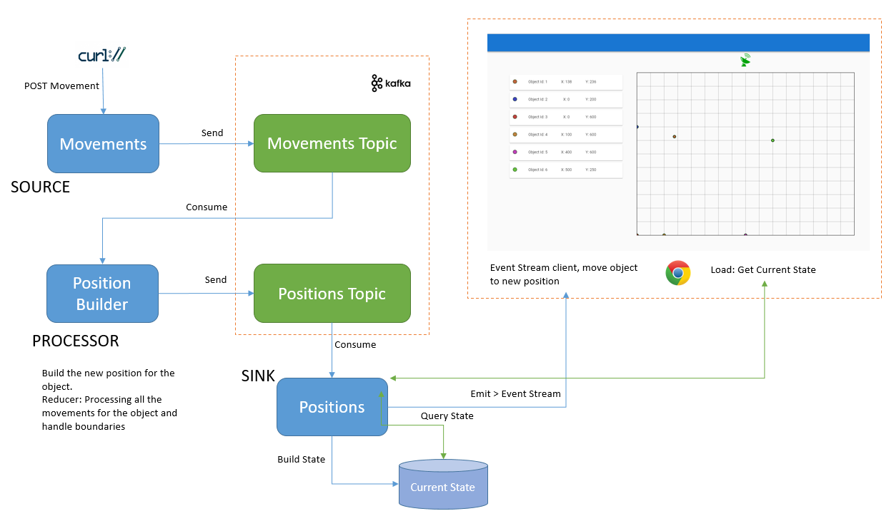

# Reactive System with Spring 5 and Kafka Streams

Table of contents
=================

<!--ts-->
   * [Table of contents](#table-of-contents) 
   * [Introduction](#introduction)
      * [Reactive Spring - Spring WebFlux](#reactive-spring---spring-webflux)
      * [Kafka Streams](#kafka-streams)
   * [Application components](#application-components)
      * [Producer: Movements Service](#producer-movements-service)
      * [Processor: Position Builder](#processor-position-builder)
      * [Sink: Positions](#sink-positions)
      * [Web: Tracker](#web-tracker)
   * [Running the application](#running-the-application)
<!--te-->

## Introduction

In plain terms reactive programming is about non-blocking applications that are asynchronous and event-driven and require a small number of threads to scale vertically (i.e. within the JVM) rather than horizontally (i.e. through clustering).

### Reactive Spring - Spring WebFlux

Spring Framework 5 includes a new spring-webflux module. The module contains support for reactive HTTP and WebSocket clients as well as for reactive server web applications including REST, HTML browser, and WebSocket style interactions.

### Kafka Streams 

Kafka Streams is a client library for building applications and microservices, where the input and output data are stored in Kafka clusters. 

## Application components

This demo application is a simple distributed system. The use case is to track object positions.

* **Source**: The Movements service acts as producer, it receives movement information for an object and send it to a Kafka topic.

* **Processor**: The Position Builder service consumes the movements events from the topic, builds the final position and send the result to another Kafka topic.  

* **Sink**: The Positions service consumes the positions and builds the current state for all the objects. Moreover, it propagates the event to the web clients by an Event Stream in order to be consumed. 

* **Web**: The Web Tracker is a web application that draws the current position for all the objects and any update received by the Event Stream. 



### Producer: Movements Service 
The Movements service is a POST endpoint where we can send details about the movement of an object. 

For example, if we want to tell the system that the object with id=1 has moved 10 units (pixels) to the right and 10 units down, we'll need to do a POST request with the following content:

```json
{
"objectId": 1,
"x": 10,
"y": 10
}
``` 

Using cURL
 
```
$ curl -X POST -H "Content-Type: application/json" -d '{"objectId": 1, "x": 10, "y": 10}' http://${HOST}:${PORT}/movements
```

The first POST for an objectId is the initial position for the object. 

The reactive controller was developed using Spring WebFlux.

The service will send the event to the Kafka topic in order to be processed.
The Kafka producer is working in *Fire and Forget* mode, that means that the producer will handle the topic communication using its internal mechanism provided by the Kafka client API. Since the producer works on F&F mode, we are not waiting for the ```send()``` reponse to resolve the HTTP POST request. Most of the time, messages will arrive successfully, since Kafka is highly available and the producer will retry sending messages automatically. 
However, some messages will get lost using this method.

If we don't want to loose any message, we can use the Asynchonous way, KafkaProducer can be configured to retry some kind of errors automatically, so the application code will get retriable exceptions only when the number of retries was exhausted and the error was not resolved. Some errors will not be resolved by retrying. For example, “message size too large.” In thosecases, KafkaProducer will not attempt a retry and will return the exception immediately.

With the Asynchronous way, we can provide a callback function to the ```send()``` method, which gets triggered when it receives a response from the Kafka broker. Unfortunatelly,Spring doesn't support this kind of callback, but we can implement a *ProducerInterceptor*, and perform some operations if there are problems with the producer. 
For example, if Kafka is not available, the producer will throw *TimeoutExcepion* after the retry time window, in that case we could store those messages to be sent later when Kafka will be available again.   

It's possible to change this behaviour by configuration, making the produder working as **sync**, that means that we'll wait for the ```send()``` method response to perform the HTTP response to the client. If the ```send()``` method fails it will throw an exception then we can forward the exception to the HTTP handler and communicate the error to the client. This could be a more simple and safe way of handling producer problems, but we are adding some waiting time to each request.   
### Processor: Position Builder

The processor consumes the *movements* topic using the Kafka Streams API, with Spring Clud Stream and the Kafka binder. 
In order to calculate the final position for the given object, the processor will perform:
  - A *GroupByKey* for grouping records with the same key 
  - A *Reducer* to sum each coordinate for all records for the same id.
    - It handles canvas boundaries, so if the result > MAX then result = MAX or if result < MIN then result = MIN.
  - Build the *position* object with the Reducer result
  - Send the new position to the positions topic. 

The processor was developed using Spring Cloud Stream and the Kafka Streams binder.

### Sink: Positions 

The Positions service will expose two endpoints:

  - GET Positions: It will provide a JSON array with the current position for each objectId.   
    Service will consume *positions* topic using Kafka Streams API and will build a materilize view with the last position for each object. 

  - GET Positions Stream: An EventStream endpoint that will receive data when an object updates its position. 
    Position events from the positions topic will be propagated through the EventStream to the consumers. This event propagation (hot-stream) was developed using EmitterProcessor and FluxSink from Reactor. 

Position service was developed using Spring WebFlux and Spring Cloud Stream and the Kafka Streams binder.

### Web: Tracker

The web was developed using VueJs framework. It request current positions to the positions service to draw the points on the canvas. When a new event arrives through the Event Stream, it performs an object animation from the current position to the new position. 


## Running the application

* Requirements
  * Java 1.8 
  * Maven 3 
  * Docker Compose 
  
* Clone the Git Repo
* Run Zookeeper and Kafka:

  	```
     cd stack
    ```

    ```
      $ docker-compose up -d 
    ```  

* Movements Service, it will use the port 8080.

    ```
    $ cd movements
    ```

    ```
    $ mvn spring-boot:run 
    ```

	Check that movements topic was created. From the **stack** folder execute:

    ```
    $ docker-compose exec kafka kafka-topics --describe --topic movements --zookeeper zookeeper:2181
    ```
   
    Post a movement, the first movement for an object is the initial position. 

    Using cURL:
 
    ```
    $ curl -X POST -H "Content-Type: application/json" -d '{"objectId": 1, "x": 10, "y": 10}' http://localhost:8080/movements
    ```
    Or using [HTTPie](https://httpie.org/):

    ```
   	$ http POST :8080/movements objectId=1 x=100 y=50 
    ```

* Position-builder:

    ```
     $ cd position-builder
    ```

    ```
    $ mvn spring-boot:run 
    ```         

    Check that positions topic was created. From the **stack** folder execute:

    ```
    $ docker-compose exec kafka kafka-topics --describe --topic positions --zookeeper zookeeper:2181
    ```

* Positions

   ```
   $ cd position
   ```
   Run:

   ```
   $ mvn spring-boot:run 
   ``` 

   Check the positions endpoint. Service is using port **8085**:

   Using cURL:
 
   ```
    $ curl http://localhost:8085/positions
   ```
   
   Using HTTPie:

   ```
   $ http :8085/positions 
   ```
   
* Web 

  ```
  $ cd web-tracker
  ```
  Install NPM dependencies:

  ``` 
  $ npm install
  ``` 

  Run. By the default web server uses 8080 port, and that port is used by the *movements* service. The server will try to find the next available port if you execute: 

  ```
  npm run dev
  ``` 

  Or you can specify the port running: 

  ```            
  $ PORT=8082 npm run dev
  ``` 

* Clean

  - Remove Kafka and Zookeeper containers. From the **stack** folder:
    
  ```     
   $ docker-compose down
  ```

  - Remove foler /tmp/kafka-streams


 
 


 


 
