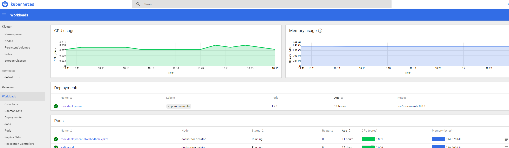

# Kubernetes deployment 

Requirements:

* Kubernetes using the desktop version by Docker (Win/Mac). 
    * Traefik as reverse proxy and microservice gateway
    * Zookeeper and Kafka as streaming platform

## Apache Kafka

Confluent provides Docker images for:

* Kafka: *confluentinc/cp-kafka:4.0.1-1*   
* Zookeeper: *confluentinc/cp-zookeeper:4.0.1-1*

* Basic Kubernetes deployment: As we are running only one Kubernetes node, in order to reduce resource consumption, we'll deploy only one Zookeeper and Kafka instance: 

```  
kubectl create -f zookeeper.yaml 

kubectl create -f kafka.yaml
```

We are not exposing Zookeeper and Kafka services outside the Kubernetes cluster. 

## Traefik 

*[Traefik](https://traefik.io/) is a modern HTTP reverse proxy and load balancer that makes deploying microservices easy.*

Træfik as an [Ingress controller](https://docs.traefik.io/user-guide/kubernetes/) for a Kubernetes cluster.  

If you are not familiar with Ingresses in Kubernetes you might want to read the Kubernetes [user guide](https://kubernetes.io/docs/concepts/services-networking/ingress/)

Kubernetes deployment: 

```
kubectl apply -f https://raw.githubusercontent.com/containous/traefik/master/examples/k8s/traefik-rbac.yaml
 
kubectl apply -f https://raw.githubusercontent.com/containous/traefik/master/examples/k8s/traefik-deployment.yaml

```


Traefik service details: 

```
kubectl describe svc -n kube-system traefik-ingress-service

Name:                     traefik-ingress-service
Namespace:                kube-system
Labels:                   <none>
Annotations:              kubectl.kubernetes.io/last-applied-configuration={"apiVersion":"v1","kind":"Service","metadata":{"annotations":{},"name":"traefik-ingress-service","namespace":"kube-system"},"spec":{"ports":[{"name":"...
Selector:                 k8s-app=traefik-ingress-lb
Type:                     NodePort
IP:                       10.107.39.231
LoadBalancer Ingress:     localhost
Port:                     web  80/TCP
TargetPort:               80/TCP
NodePort:                 web  32523/TCP
Endpoints:                10.1.1.247:80
Port:                     admin  8080/TCP
TargetPort:               8080/TCP
NodePort:                 admin  32222/TCP
Endpoints:                10.1.1.247:8080
Session Affinity:         None
External Traffic Policy:  Cluster
Events:                   <none>

```

Service exposes two ports by defining *Type: NodePort*, that means that we can access the Kubernetes cluster through those ports. 
In this case:

* The Traefik *admin* dashboard exposed by Traefik using the **8080** port, is accesible from outside the cluser using the **32222** port (assigned by Kubernetes)
* The services will accessible then using the **32523** port. 

## Services deployment

The script will build Docker images and will perform Kubernetes deployment using *kubectl*.

```
 $ ./build-k8-deploy.sh 
```

Endpoints exposed through the Traefik ingress:

 * /movements: For the movements service 
 * /positions and /positions/stream for the positions service
 * /web for the web application 


Web application defines an environment variable to set the API url:

*config/prod.env.js* 

```js
module.exports = {
  NODE_ENV: '"production"',
  ROOT_API: process.env.ROOT_API || '"http://localhost:32523"'  //kubernetes Traefik exposed port
}
```
You can change the default value at this file and set your URL.
Or define an environment variable at the Dockerfile at the build phase. 


## Kubernetes dashboard

Kubernetes dashboard is not included with the Docker for desktop (Win/Mac) Kubernetes distribution, so we'll need to deploy it:

```
kubectl apply -f https://raw.githubusercontent.com/kubernetes/dashboard/master/src/deploy/alternative/kubernetes-dashboard.yaml 
```  

After deployment, we'll need to expose the dashboard to outside the cluster, as we are using the Traefik Ingress controller, we can define an Ingress rule to expose the dashboard through Traefik. 

```yml
apiVersion: extensions/v1beta1
kind: Ingress
metadata:
  name: kubernetes-dashboard
  namespace: kube-system
  annotations:
   kubernetes.io/ingress.class: traefik
   traefik.frontend.rule.type: PathPrefixStrip
spec:
  rules:
  - host: localhost
    http:
      paths:
      - path: /dashboard
        backend:
          serviceName: kubernetes-dashboard
          servicePort: 80
```
Execute: 

```
kubectl apply -f kube-dashboard-ingress.yaml
```

An then the Kubernetes dashboard will be accessible at [http://localhost:32523/dashboard/](http://localhost:32523/dashboard/)
There are other ways of exposing the dashboard, defining the service as *NodePort* or using the *kubectl proxy* command. 

### Dashboard Metrics

In order to get metrics and graphs from the [Dashboard](https://github.com/kubernetes/dashboard), [Heapster](https://github.com/kubernetes/heapster/) has to be running in the cluster.



[Heapster](https://github.com/kubernetes/heapster/) deployment: 

```
kubectl apply --filename https://raw.githubusercontent.com/kubernetes/heapster/master/deploy/kube-config/rbac/heapster-rbac.yaml
kubectl apply --filename https://raw.githubusercontent.com/kubernetes/heapster/master/deploy/kube-config/standalone/heapster-controller.yaml
```

#### Metrics Server 

Metrics Server exposes core Kubernetes metrics via metrics API. The Metrics Server is needed to apply Horizontal Pod Autoscaling.

```
kubectl create -f ./metrics-server
```

## Using Helm 

Alternatively, you can also use the Traefik [Helm](https://helm.sh/) [chart](https://github.com/kubernetes/charts/tree/master/stable/traefik) for Traefik deployment. 

The [Helm](https://helm.sh/) [Kafka chart](https://github.com/kubernetes/charts/tree/master/incubator/kafka) provides a "more realistic" scenario, with 3 Zookeeper instances and 3 Kafka instances by default. 

```
helm repo add incubator http://storage.googleapis.com/kubernetes-charts-incubator
helm install --name mykafka incubator/kafka
```

Check the chart [docs](https://github.com/kubernetes/charts/tree/master/incubator/kafka) for more details. 

